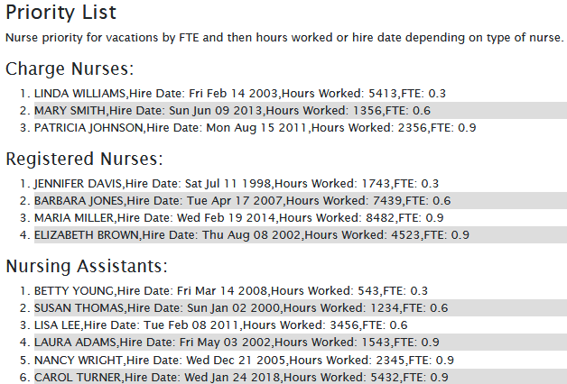
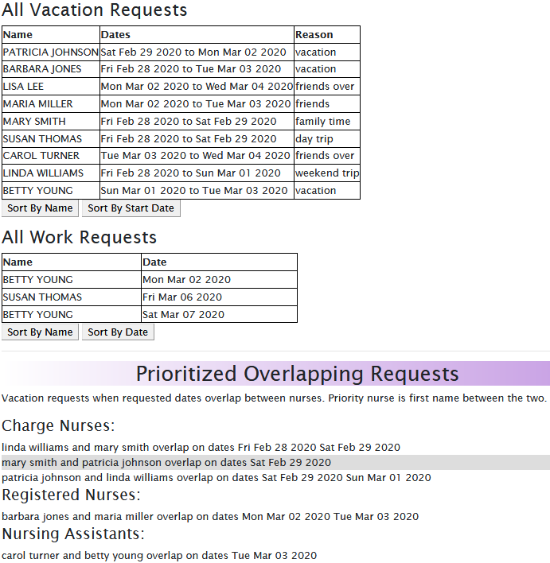

# [NurScheduler](https://github.com/ayohana/nurse_NATA.git/)

#### Team Week Javascript Project for Epicodus, 02.17.2020

#### _**By Adela Darmansyah, Tiffany Siu, Andriy Veremyeyev, Neha Doodi**_

## Description

**This application was made to ease the work of a nurse scheduler. The nurse scheduler can input the nurse's requests which consists of  vacation start date, vacation end date, number of days requested off & additional comments as required.  
This application also allows nurse scheduler to add work requests made by nurses nad display it for references and update the due dates for form submmision. 
It sorts the vacation requests by name or by job start date. 
Priority is given to nurses in the following order:**

* FTE level (full-time, part-time and per diem)
  * Per diem nurses are more able to have less working days so they have a higher priority for getting vacation days.
* Seniority level
  * Charge Nurses and Registered Nurses have seniority by the number of cumulative hours worked.  Nursing Assistants have seniority by their hire date.
* Previous year vacation dates
  * Nurses must take turns getting vacation dates off so if they had the same dates off in previous years, they are not allowed to get the same dates off this year.
* Holiday work requests
  * Special rules apply for holidays of ranking which holiday they want off the most.

Note: This application does **not** make decisions on which nurse gets the dates off and instead assists the nurse scheduler by providing an interface showing all relevant data in one place and providing priority lists for staff and requests.

## Setup/Installation Requirements

* Clone this [repository](https://github.com/ayohana/nurse_NATA.git/)
* Open the command line and navigate into the repository.
  * Use the command `npm install` to install all necessary plugins.
  * Use the command `npm run start` to start the web application.
* Start submitting requests.                                                                                        

## Requirements to Run
* _Web Browser_
* _Webpack_
* _Node.js_
* _NPM_

## Other Technologies Used

* _HTML_
* _CSS_                                                                    
* _Javascript_
* _JQuery 3.4.1_
* _Bootstrap 4.4.1_
* _ESLint_
* _Babel_
* _Jest_
* _Markdown_

## Notable Features
* It allows the scheduler to sort the requests by name or by date. 
* It does not accept enteries if the form is submiited past due date.
* If vacation start date is after the work return date, it does not takes the entry.
* Pairs of nurses with overlapping vacation requests are listed with overlapping days and the nurse with higher priority is listed first.

## User Stories

* As a scheduler, I want to be able to organize nurses vacation schedules without much paperwork so that I can be more efficient.
* As a scheduler, I want to see a list of requests with the overlapping dates and the nurses that sent in the requests organized by priority so I can see which staff member should have priority in getting the request approved.

## Specifications

| Spec                                                                | Example Input | Expected Output                                                              |
| :------------------------------------------------------------------ | :------------ | :--------------------------------------------------------------------------- |
| Show priority list of all nurses using priority rules | Susan Thomas   Lisa Lee   Nanacy Wright   Betty Young | Lisa Lee   Susan Thomas   Betty Young   Nanacy Wright |
|Reject vacation request if submitted date is after due date for requests|Subbmission Due Date:  02/20/2020   User Submission Date: 03/20/2020| "Vacation request is past the submission due date"|
|Gather input for work requests from nurses| Susan Lee : 02/23/2020, 03/14/2020   Carol Tuner: 03/21/2020| Susan Lee 02/23/2020   Susan Lee 03/14/2020   Carol Turner 03/21/2020
|Sort the list by last name| Jennifer Davis   Lisa Lee   Laura Adams| Laura Adams   Jennifer Davis   Lisa Lee
|Prioritize nurses by FTE level|Susan Thomas 0.6   Laura Adams per diem   Nancy Wright 0.9|Laura Adams   Susan Thomas   Nancy Wright
|Prioritize nurses by hours worked|Jennifer Davis: 1743 hrs   Barbaar Jones: 7439 hrs   Maria Miller: 8482 hrs| Maria Miller   Barbara Jones   Jennifer Davis
|The application shows overlapping vacation requests dates| Elizabeth Brown = 2/4-2/6   Jennifer Davis = 2/5-2/7  |Elizabeth Brown and Jennifer Davis have overlapping vacation request dates  as follows 2/5-2/6

## Screenshots

_Here is a snippet of what the input looks like:_

_Here are some snippets of what the output looks like:_

## Known Bugs

There are currently no known bugs in this program.

## Improvement Areas:

* Use Calendar API to show nurses vacations
* Use API for hardcoded holidays
* Upload spreadsheet for schedule
* Pull data for nurses from excel spreadsheet
* Consider day shift vs night shift
* Taking into account prime time holidays (christmas, new year, etc)

## Work Distribution
 * Adela
    * Project Manager
    * Full-Stack
 * Andriy
    * Full-Stack
 * Neha 
    * Full-Stack
 * Tiffany
    * Lead Full-Stack

## Support and contact details

* [Adela Darmansyah](mailto:adela.yohana@gmail.com)
* [Tiffany Siu](mailto:tsiu88@gmail.com)
* [Neha Doodi](mailto:nehadoodipoonia@gmail.com)
* [Andriy Veremyeyev](mailto:belyybrat@gmail.com)

### License

*This software is licensed under the MIT license*

Copyright (c) 2020 **_Adela Darmansyah, Tiffany Siu, Andriy Veremyeyev, Neha Doodi_**
